# 日経平均を予測する

chainerを使ってLSTMで予想

[その２](LSTM2.md)、予測値から予測       
[その３](CNN.md)、予測値から予測、リターンをラベル化      


## 参考
[sin波](http://seiya-kumada.blogspot.jp/2016/07/lstm-chainer.html)
## ソース
[LSTM](../cao/)

----

## LSTM その１
#### training
期間：2001-01-01 - 2011-12-31       
終値をLSTMで学習      
隠れ層　２      
学習回数　４０００
```
python 20_nk225_train.py
```
学習収束度合い
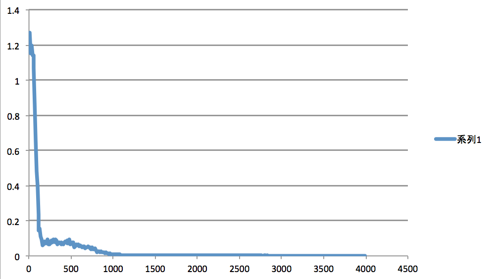
#### predict
期間：2012-01-01 - 2015-12-31
当日終値から翌日終値を予想
```
python 20_nk225_predict.py
```
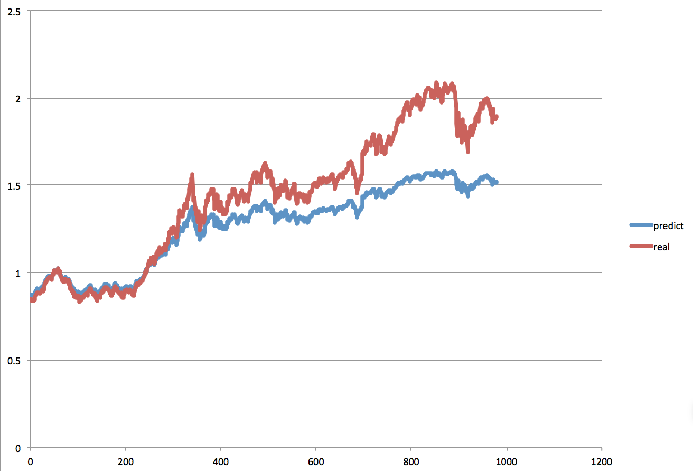

実際の日経平均を毎回与えて次の日の日経平均終値を予想している。予想値を使って次の予想しているのではない。      
なんかおかしい。。。

----

## LSTM その２
当日日経平均のリターンで翌日の日経平均のリターンを予測する。トレンド排除のため
#### training
```
python 22_nk225_train.py -g 0
[10]training loss:	2.82123541832	1.21526389122[sec/epoch]
[20]training loss:	2.52860355377	1.06159331799[sec/epoch]
[30]training loss:	2.68424487114	1.0626486063[sec/epoch]
[40]training loss:	2.18472719193	1.05503828526[sec/epoch]
[50]training loss:	2.14170384407	1.05719461441[sec/epoch]

[1220]training loss:	2.51669025421	1.04156088829[sec/epoch]
[1230]training loss:	2.6875243187	1.04251070023[sec/epoch]
[1240]training loss:	2.14866399765	1.04250369072[sec/epoch]
[1250]training loss:	2.65396571159	1.04227662086[sec/epoch]
```
収束する気配なし
#### 検証
```
> # nk225 vs yesterday nk225
> cor(data.ret$nk225[-1],data.ret$nk225[1:length(data.ret$nk225)-1])
[1] -0.05554542
```
日経平均ノリータンと翌日リターンの相関はもともｔない

----

## LSTM その３
日経終値、USDJPY,EURJPY,DJで翌日日経平均終値を予想
#### training
期間：2001-01-01 - 2011-12-31             
隠れ層　5      
学習回数　1000     
```
python 23_nk225_train.py
```
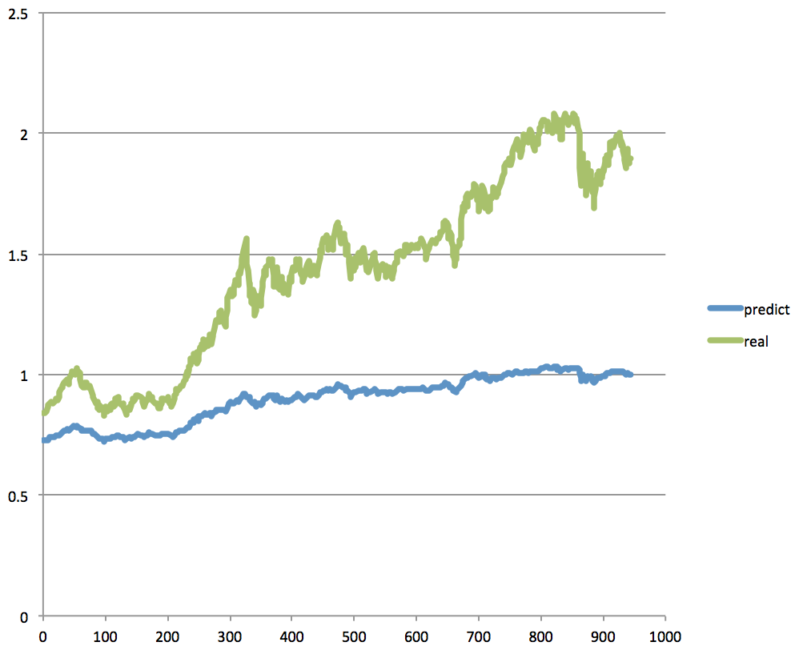
リターンにしてないのでなにかおかしい？

----

## LSTM その４
相関の高い指数で予測
#### 相関を検査
各指数と日経平均の相関を取る（リターンに直して比較）
```
R 24_nk225.R
```
```
> # nk225 vs yesterday dj
> cor(data.ret$nk225[-1],data.ret$dj[1:length(data.ret$dj)-1])
[1] 0.5035617
> # nk225 vs dj
> cor(data.ret$nk225,data.ret$dj)
[1] 0.2010709
>
> # nk225 vs yesterday usdjpy
> cor(data.ret$nk225[-1],data.ret$usdjpy[1:length(data.ret$usdjpy)-1])
[1] 0.02514359
> # nk225 vs yesterday eurjpy
> cor(data.ret$nk225[-1],data.ret$eurjpy[1:length(data.ret$eurjpy)-1])
[1] 0.2430042
> # nk225 vs yesterday dax
> cor(data.ret$nk225[-1],data.ret$dax[1:length(data.ret$dax)-1])
[1] 0.3704378
> # nk225 vs yesterday lbond
> cor(data.ret$nk225[-1],data.ret$lbond[1:length(data.ret$lbond)-1])
[1] 0.01544805
> # nk225 vs yesterday gold
> cor(data.ret$nk225[-1],data.ret$gold[1:length(data.ret$gold)-1])
[1] 0.006167552
> # nk225 vs yesterday oil
> cor(data.ret$nk225[-1],data.ret$oil[1:length(data.ret$oil)-1])
[1] 0.1420085

```
DJとDAXが翌日日経平均と相関高い。

#### LSTMで学習
DJ、DAX、NK225から翌日NK225リターンを予測
```
$ python 25_nk225_train.py
[0]training loss:	0.00843129511587	0.0532327389717[sec/epoch]
[100]training loss:	0.000353474296883	5.2680078721[sec/epoch]
[200]training loss:	0.000327420497466	5.27066521883[sec/epoch]
[300]training loss:	0.000322797076258	5.2680966115[sec/epoch]
[400]training loss:	0.000362382384245	5.26886979103[sec/epoch]
[500]training loss:	0.000298788259646	5.26744771957[sec/epoch]
[600]training loss:	0.000284833396843	5.26006275177[sec/epoch]
[700]training loss:	0.000267396290938	5.25015475035[sec/epoch]
[800]training loss:	0.000247338163351	5.2517221117[sec/epoch]
[900]training loss:	0.000242872159921	5.28393788815[sec/epoch]
```
#### 予測
```
$ python 25_nk225_predict.py
```
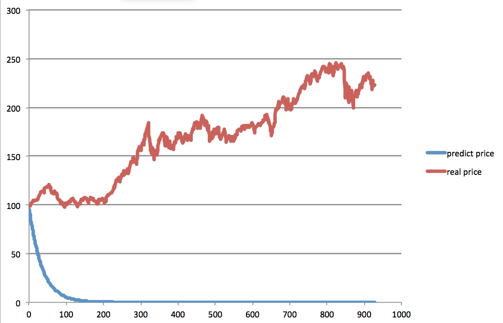
```
R 25_nk225.R
> data$diff.ratio<-data$predict.ret-data$real.ret
> hist(data$diff.ratio)
> summary(data$diff.ratio)
    Min.  1st Qu.   Median     Mean  3rd Qu.     Max.
-0.08677 -0.03621 -0.02980 -0.02947 -0.02300  0.03998
```
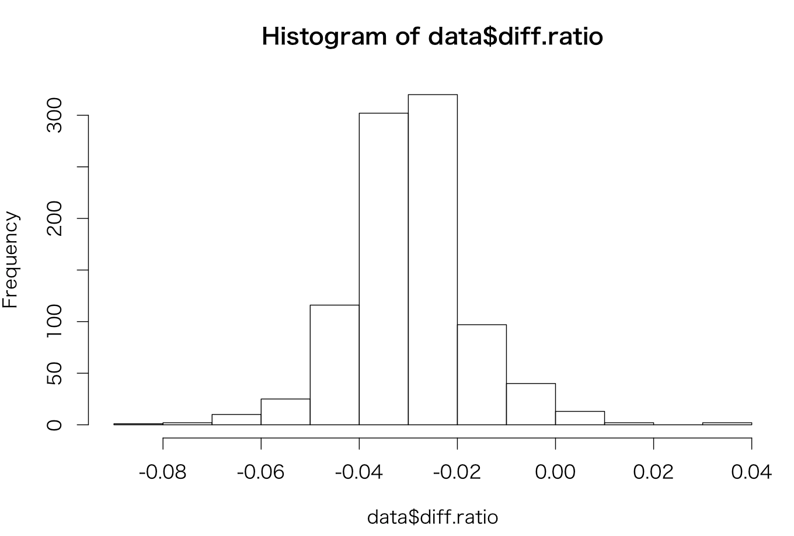

当てはまり悪い？？？


----

## LSTM その5
相関の高いDAX,DJ,EURJPY,OILのリターンから翌日日経平均リターンを予測


#### 結果　
```
$ python 26_nk225_train.py
[0]training loss:	0.000458222238263	0.0121049880981[sec/epoch]
[100]training loss:	0.000378463398572	1.20937556982[sec/epoch]
[200]training loss:	0.000291516938851	1.21475180149[sec/epoch]
[300]training loss:	0.000240746136736	1.21512123108[sec/epoch]
[400]training loss:	0.000212938342262	1.21973088026[sec/epoch]
[500]training loss:	0.000228104504509	1.22057434082[sec/epoch]
[600]training loss:	0.000195311167132	1.22257600069[sec/epoch]
[700]training loss:	0.000221543950052	1.22525330067[sec/epoch]
[800]training loss:	0.000208990208468	1.22467413902[sec/epoch]
[900]training loss:	0.000204513027291	1.22452023983[sec/epoch]
1220.31528878[sec]
$ python 26_nk225_predict.py > 26_nk225.csv
```
###### 2012-01-01 から 2015-12-31
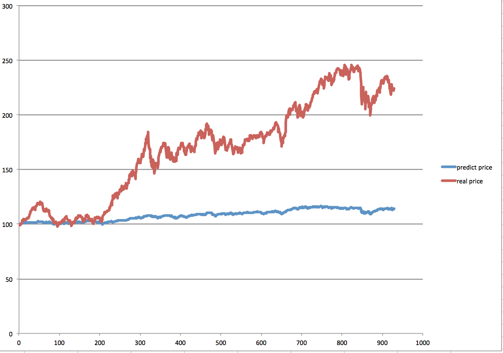
だめ

###### 詳細確認
```
R 26_nk225.R
> data<-read.csv("26_nk225.csv")
>
> data$diff.ratio<-data$predict.ratio-data$real.ratio
> hist(data$diff.ratio)
> summary(data$diff.ratio)
      Min.    1st Qu.     Median       Mean    3rd Qu.       Max.
-0.0688100 -0.0078270 -0.0007567 -0.0008160  0.0057240  0.0722700
```
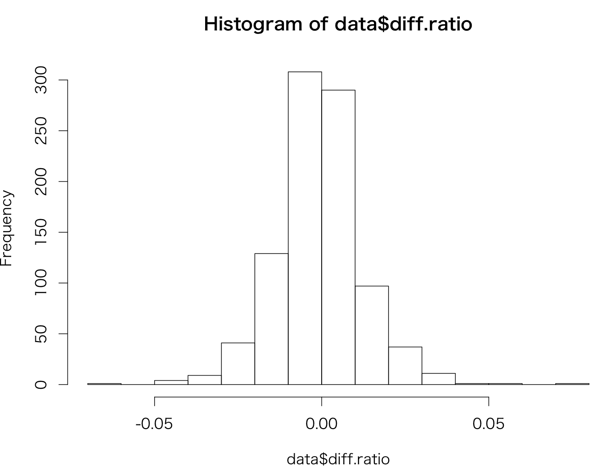
リターンの予測値と実際の値の差、プラス寄りに出ている？

-----

## LSTM6
日経平均、DAX,DJ,EURJPY,OILのリターンから翌日日経平均、DAX,DJ,EURJPY,OILリターンを予測
#### 結果　
```
$ python 27_nk225_train.py
[0]training loss:	0.00365646849925	0.0120643091202[sec/epoch]
[100]training loss:	0.000366687624898	1.20223164082[sec/epoch]
[200]training loss:	0.000278182608548	1.20302567959[sec/epoch]
[300]training loss:	0.000303541352252	1.20208760023[sec/epoch]
[400]training loss:	0.000279011120599	1.20133442163[sec/epoch]
[500]training loss:	0.000293794120826	1.19932712078[sec/epoch]
[600]training loss:	0.000253571300351	1.19965209007[sec/epoch]
[700]training loss:	0.000283492682268	1.20147184134[sec/epoch]
[800]training loss:	0.000271181627434	1.20065570831[sec/epoch]
[900]training loss:	0.000264234354149	1.19936295033[sec/epoch]
1200.81790805[sec]

```
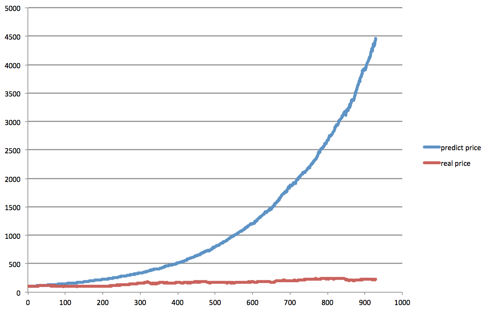
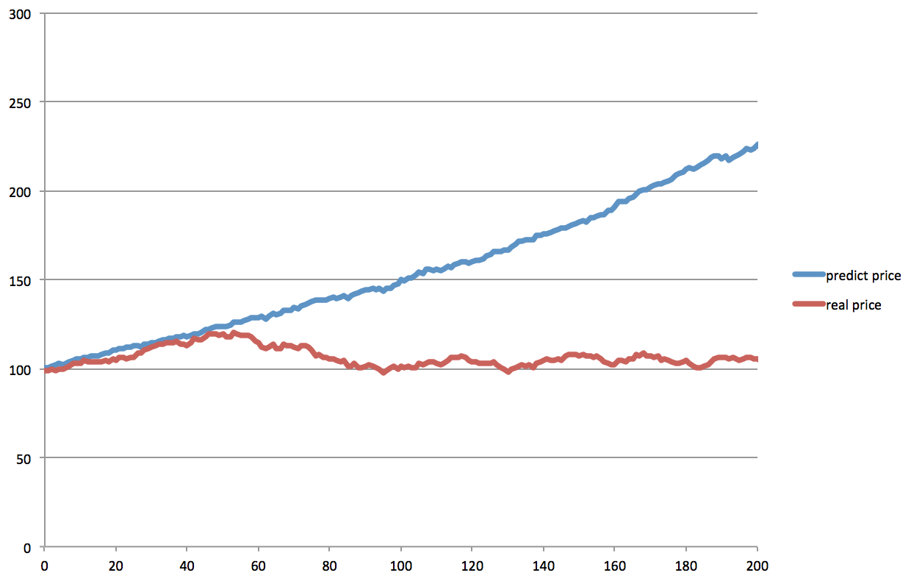
だめ

----


## LSTM その7
[日経平均回帰分析](NKLM.md)からパラメタを選定

nn layer : 2 layer
epochs : 500    
mini batch size: 100    
mini batch sequence : 200    

###### トレーニング
```
python 31_nk225_train.py
```
```
/usr/local/Cellar/python/2.7.12/Frameworks/Python.framework/Versions/2.7/bin/python2.7 /Users/utsubo/Documents/workspace/sentiment/cao/31_nk225_train.py
[0]training loss:	0.000400270386856	0.00794312953949[sec/epoch]
[100]training loss:	0.00037745704603	0.810767679214[sec/epoch]
[200]training loss:	0.000218795621814	0.826318759918[sec/epoch]
[300]training loss:	0.000211840617148	0.787434229851[sec/epoch]
[400]training loss:	0.000194132459074	0.775069861412[sec/epoch]
399.15498805[sec]
```
###### 予測
```
python 31_nk225_predict.py
```
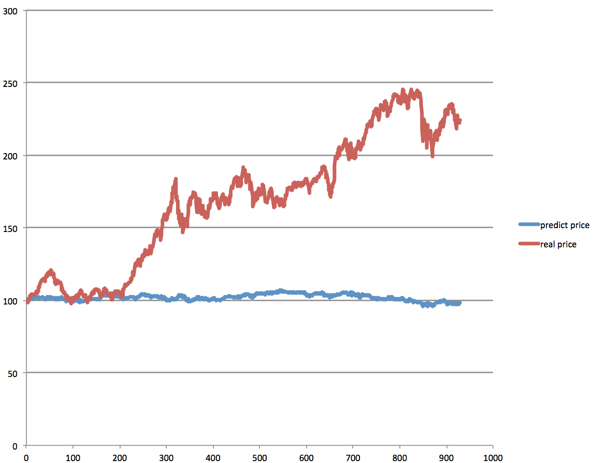


----


## LSTM その8

epocと叩き込みレイヤー数を増やす、４層


#### 訓練
```
python 33_nk225_train.py
```

まだ収束しきっていないのか？
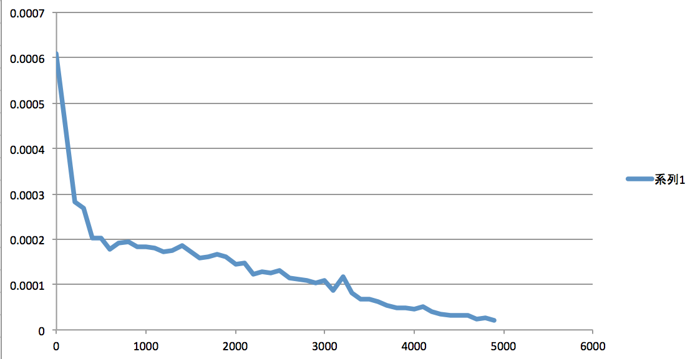
#### 結果　

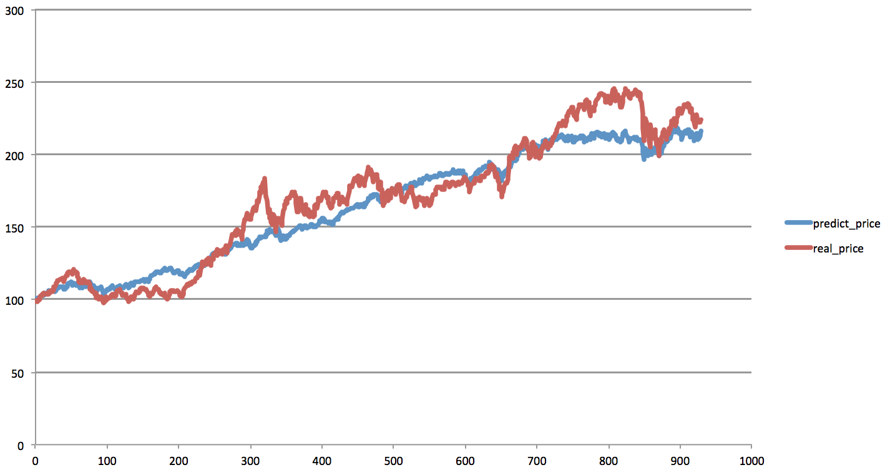

もう少しパラメタをいじってみる

----

## LSTM その9
下記組み合わせでパラメタを変化させてみる     
隠れ層４層


- sequence: 何日分の過去データを記憶させるか
- epoch:計算繰り返し数    
- hidden_units:隠れそうのユニット数
|case|epoch|hidden_units|length_of_sequence|
|:---|:---|:---|:----|
|1|20000|100|100|
|2|20000|400|100|
|3|20000|800|100|
|4|20000|100|300|
|5|40000|100|20|


#### 検証
##### case 1 , hidden 100,sequence 100


##### case 2 , hidden 400,sequence 100
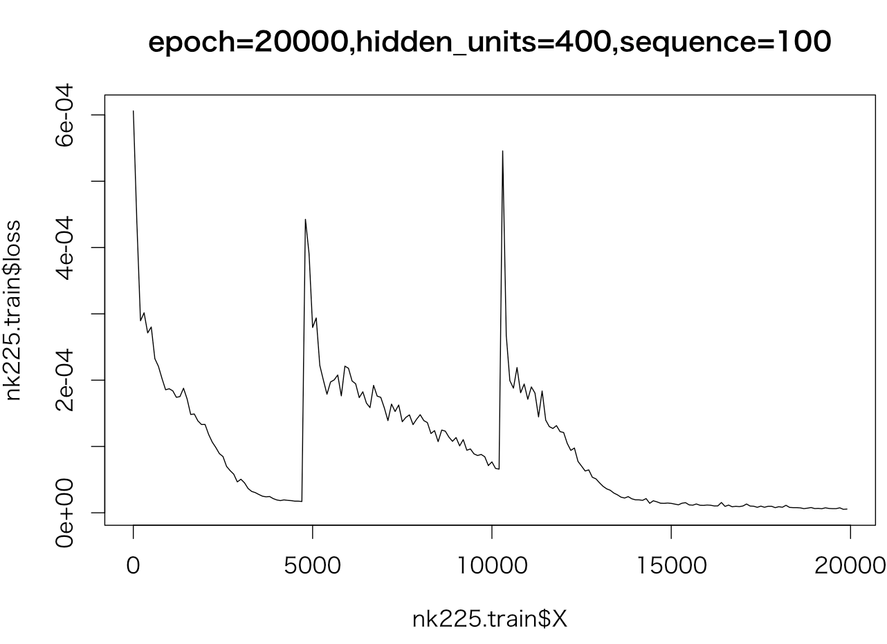
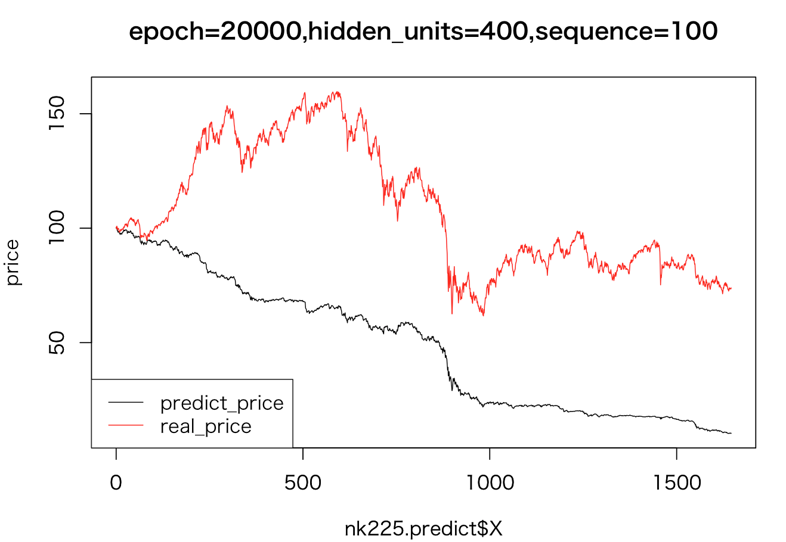
##### case 3 , hidden 800,sequence 100
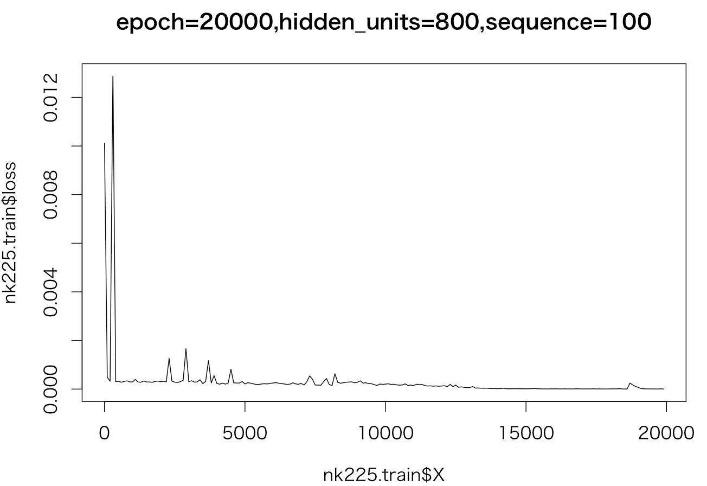

##### case 4 , hidden 100,sequence 300


##### case 5 , hidden 100,sequence 20
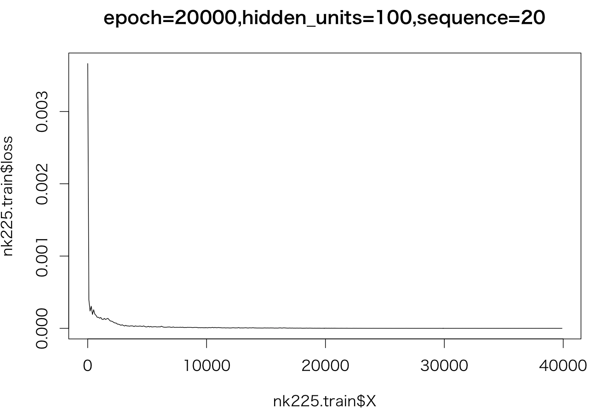
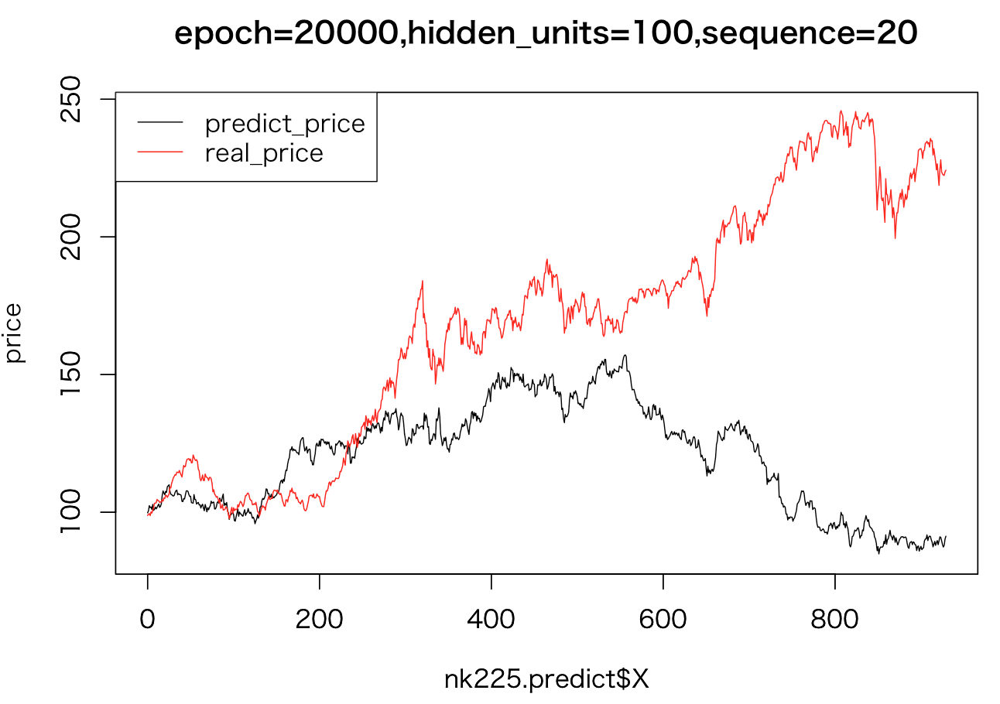
----

## まとめ
前日日経終値、DJ,DAX,GOLD,OIL,BONDなど使用できる指数を用いて前日の指数終値のリターンから、翌日の日経平均のリターンを予測してみた。
LSTMモデルによる予測を実行、[回帰分析](NKLM.md)を参考にパラメタを入れ替えながら学習させた。       

20050101-20111231までのデータで学習させて（DAXが2005より）、20120101-20151231までを予測した。        
予測方法は、前日の終値を入れて当日予測を繰り返したものを積み重ねたグラフを使用。長期予測ではなく翌日予測の積み重ね。
