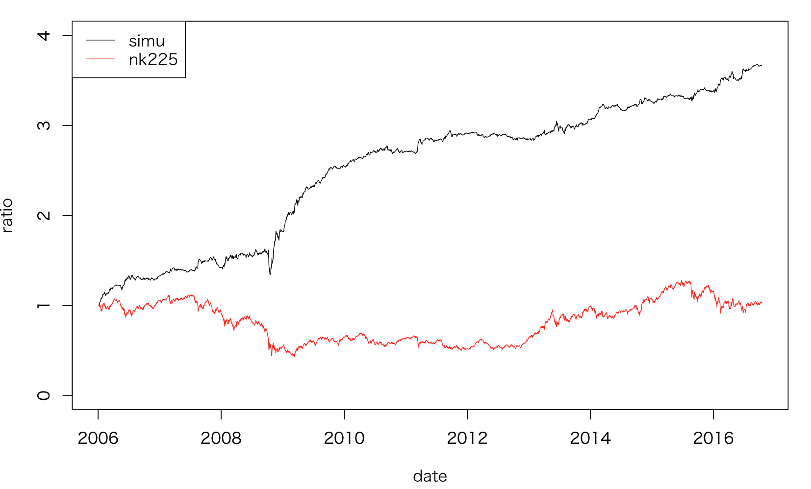
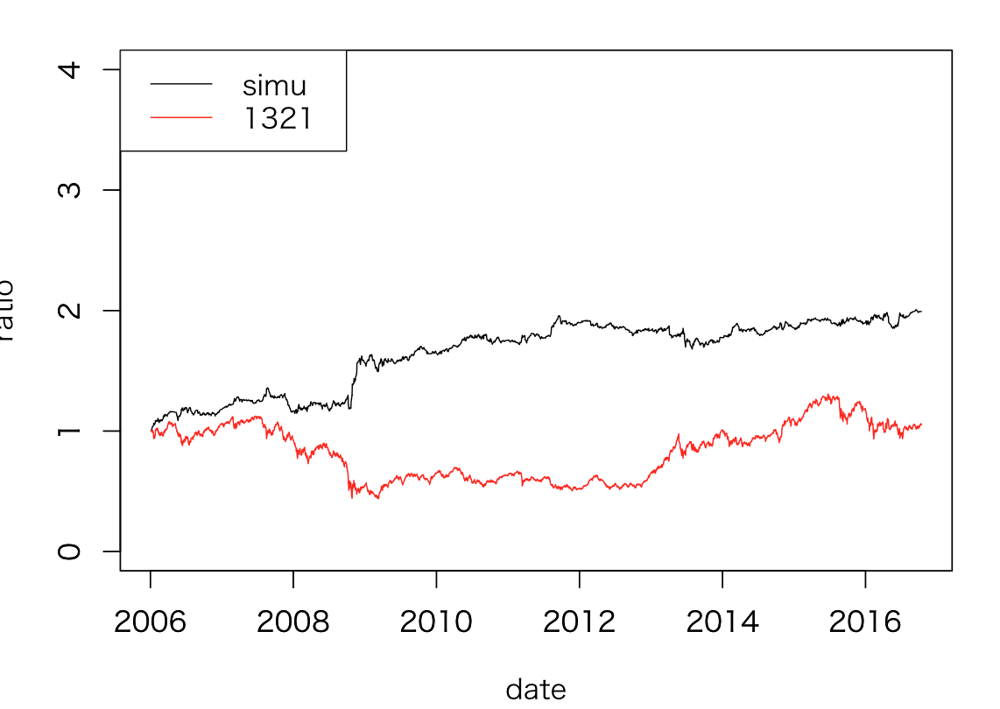
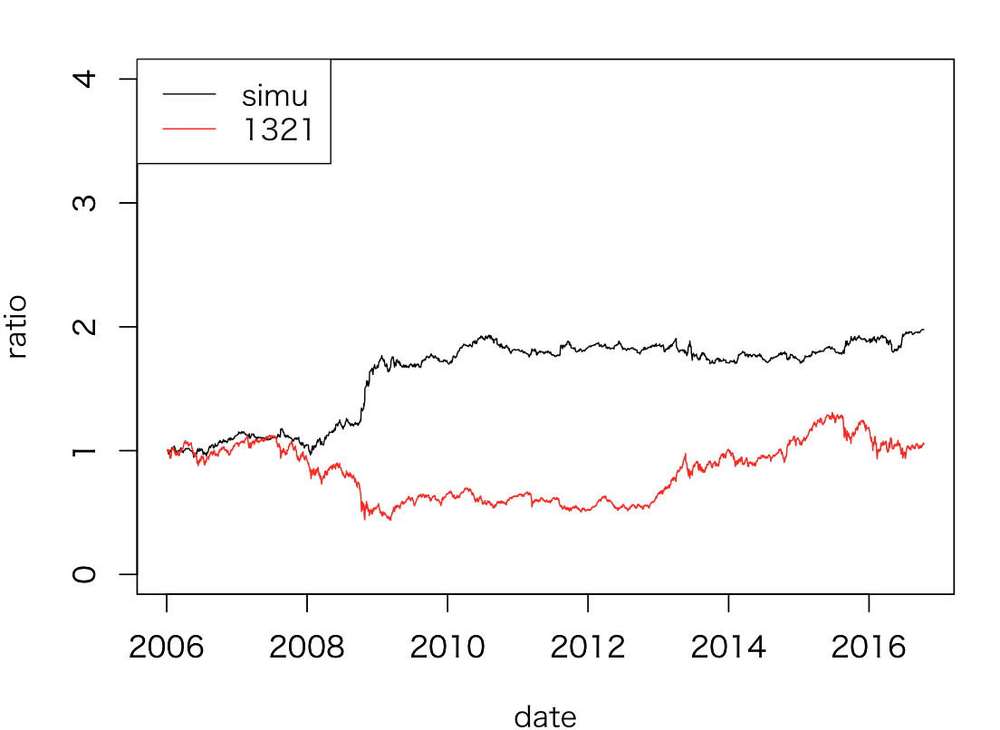
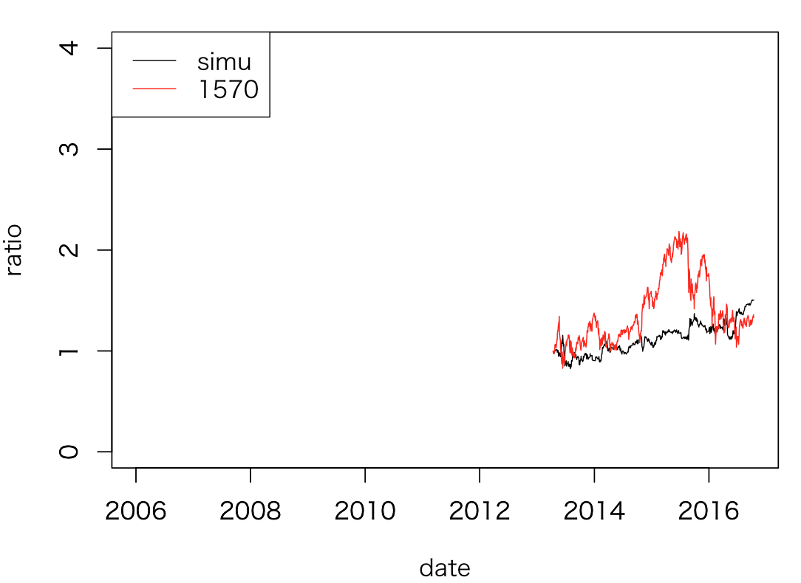
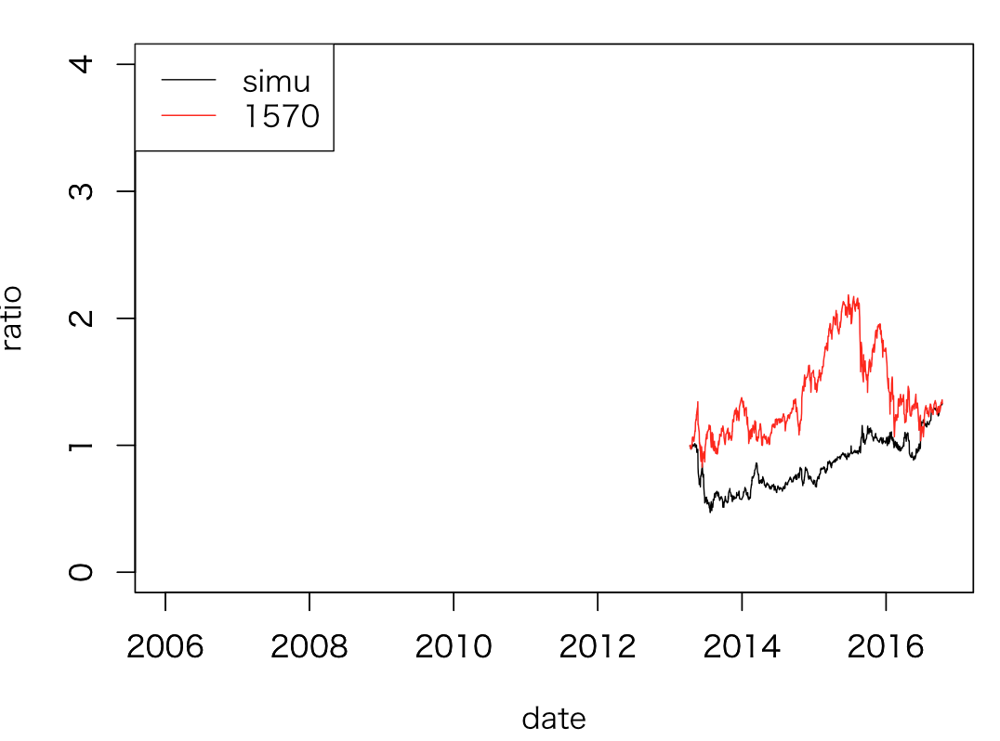
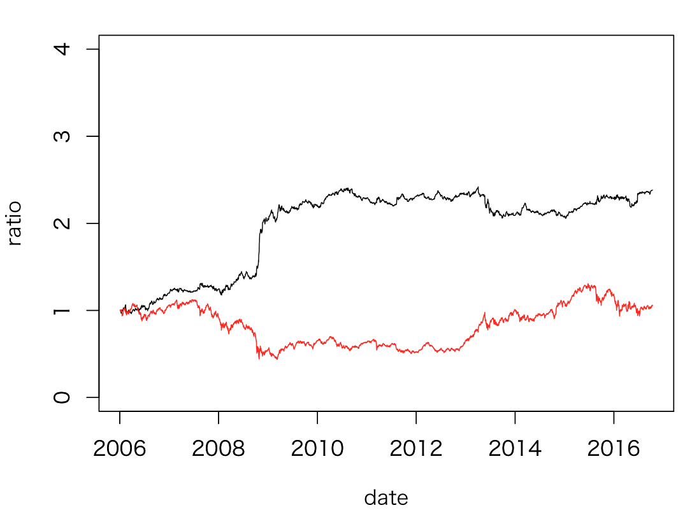

# 日経平均予測と売買シミュレーション
20161018

## 条件

期間：2006/1/1 - 2016/10/12

## 始値予測
[NK225a](./NK225a.md)のモデルを使用する

```
R 55_nk225.R
```
- モデル式
```
  data.res<-lm(nk225n ~  dj + dax ,data.lm)
```
- 正解率
```
> sum(data.df$updn)/length(data.df$updn)  # 正解率
[1] 0.7468304
```

## 終値予測
```
R 55_nk225.R
```
#### その１
- モデル式
```
  data.res<-lm(nk225n ~  dj + dax  ,data.lm)
```
- 正解率
```
> sum(data.df$updn)/length(data.df$updn)  # 正解率
[1] 0.5649762
```
#### その２
オーバーナイトリターンを入れてみる
- モデル式
```
  data.res<-lm(nk225n ~  dj + dax + nk225ov ,data.lm)
```
- 正解率
```
> sum(data.ok$updn.y)/length(data.ok$date)
[1] 0.6084881
> sum(data.df$updn)/length(data.df$updn)  # 正解率
[1] 0.6073693
```
若干良くなった

## 分析
- 始値が当たった際の終値の正解率
```
> sum(data.ok$updn.y)/length(data.ok$date)
[1] 0.6084881
```
その２の正解率とほとんど変わらない。始値予測が当たったかどうかは終値予測には関係ない

## 売買シミュレーション その１
始値予測が当たった際の、その日の足が陽線か陰線かを調査
```
R 55_nk225.R
```
```
> length(data.ok.up.in$date)    # 予測値のほうが高い、その日は陰線
[1] 511
> length(data.ok.up.yo$date)    # 予測値のほうが高い、その日は陽線
[1] 399
> length(data.ok.lo.in$date)    # 予測値のほうが低い、その日は陰線
[1] 456
> length(data.ok.lo.yo$date)    # 予測値のほうが低い、その日は陽線
[1] 519
```
始値の予測が当たったとき、予測値が高いときはSELL,予測値が低いときはBUYの戦略     
→予測値が高いときはマーケットが弱いと判断しSELLの戦略、逆も然り

- 結果
```
> sum((data.ok.up$priceseikai.x-data.ok.up$priceseikai.y)/data.ok.up$priceseikai.x)+sum((data.ok.lo$priceseikai.y-data.ok.lo$priceseikai.x)/data.ok.lo$priceseikai.x)
[1] 2.670045
```


１０年１０ヶ月で2．６倍になった？

## 売買シミュレーション　その２
日経平均指数そのものではなくETFを使ってやってみる
```
R 55_nk225.R
```
```
> length(data.ok.up.in$date)
[1] 465
> length(data.ok.up.yo$date)
[1] 445
> length(data.ok.lo.in$date)
[1] 451
> length(data.ok.lo.yo$date)
[1] 524
```
始値の予測が当たったとき、予測値が高いときはSELL,予測値が低いときはBUYの戦略  
- 結果
```
> sum((data.ok.up$oprice-data.ok.up$cprice)/data.ok.up$oprice)+sum((data.ok.lo$cprice-data.ok.lo$oprice)/data.ok.lo$oprice)
[1] 0.9923616
```


## 売買シミュレーション　その３
１３２１でパラメタ予測し売買する
- パラメタ予測
```
R 56_nk225.R
```
```
> sum(data.df$updn)/length(data.df$updn)  # 正解率
[1] 0.7678288
```
- シミュレーション
```
R 56_nk225.R
```
始値の予測が当たったとき、予測値が高いときはSELL,予測値が低いときはBUYの戦略  
- 結果
```
> sum((data.ok.up$oprice-data.ok.up$cprice)/data.ok.up$oprice)+sum((data.ok.lo$cprice-data.ok.lo$oprice)/data.ok.lo$oprice)
[1] 0.9775667

```


## 売買シミュレーション　その４
1570で実行
- パラメタ予測
```
R 56_nk225.R
```
```
> sum(data.df$updn)/length(data.df$updn)  # 正解率
[1] 0.7392374
```

- シミュレーション
```
R 56_nk225.R
```
始値の予測が当たったとき、予測値が高いときはSELL,予測値が低いときはBUYの戦略  
- 結果
```
> sum((data.ok.up$oprice-data.ok.up$cprice)/data.ok.up$oprice)+sum((data.ok.lo$cprice-data.ok.lo$oprice)/data.ok.lo$oprice)
[1] 0.5036782

```


## 売買シミュレーション　その５
翌日始値の予測値と実測値が＋ーで当たったかどうかを考慮しない。     
1570で実行
- 実行
```
R 57_nk225.R
```
- シミュレーション
予測値が高いときはSELL,予測値が低いときはBUYの戦略  
```
>sum((data.ok.up$oprice-data.ok.up$cprice)/data.ok.up$oprice)+sum((data.ok.lo$cprice-data.ok.lo$oprice)/data.ok.lo$oprice)
[1] 0.3260199
```


## 売買シミュレーション　その６
翌日始値の予測値と実測値が＋ーで当たったかどうかを考慮しない。     
1321で実行
- 実行
```
R 57_nk225.R
```
- シミュレーション
予測値が高いときはSELL,予測値が低いときはBUYの戦略  
```
> sum((data.ok.up$oprice-data.ok.up$cprice)/data.ok.up$oprice)+sum((data.ok.lo$cprice-data.ok.lo$oprice)/data.ok.lo$oprice)
[1] 1.382351
```



# まとめ
DJ,DAXの終値と翌日日経平均始値には相関が見られる。回帰分析の結果、予測した日経平均翌日始値と実際の日経平均始値の差に着目し売買を行うことにより、リターンが取れることがわかった。次の課題として、銘柄別の売買シミュレーションや、DAX,DJ以外の指数などとの関連
